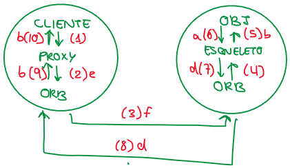

# Actividades Unidad 8 - Comunicaciones

## ACTIVIDAD 1

### OBJETIVOS: Caracterizar los mecanismos de comunicación

Responda brevemente a las siguientes preguntas (con un máximo de 50 palabras por respuesta):

1. **¿Qué diferencias existen entre los mecanismos que utilizan primitivas básicas de comunicación y los que utilizan construcciones del lenguaje de programación?**

Las **primitivas básicas** hacen operaciones de envío y recepción, mientras los que utilizan **construcciones de lenguaje de programación** tiene un mayor nivel de abstracción, el envío y recepción de mensajes es transparente al programador.

2. ¿Cómo puede ser la estructura de los mensajes en un mecanismo de comunicación cualquiera?
- No estructurados, solo contenido: contendido de formato libre

- Estructura en cabecera + contenido: cabecera es un conjunto de campos, generalmente extensible, contenido de formato libre

- Estructura transparente al programador: determinada por el middleware 
3. En los mecanismos de comunicación el contenido de los mensajes puede ser en bytes o bien en texto. ¿Qué ventajas presentan los mensajes de texto frente a los mensajes en bytes?

Los mensajes de texto (multiplataforma) son independientes de la arquitectura y el lenguaje de programación, mientras que para bytes no es universal

4. ¿Qué diferencias existen entre el direccionamiento directo y el indirecto?

El direccionamiento directo el ordenador emisor envía los mensajes directamente al ordenador recetor, mientras que en el direccionamiento indirecto el ordenador emisor enviá los mensajes en un intermediario(bróker), el cual se encarga de hacerlos llegar al receptor

5. ¿Qué tipos de sincronización existen en los mecanismos de comunicación? ¿Podrías dar ejemplos de cada uno?
- Comunicación Asíncrona: el que envía nunca se bloquea (Sockets UDP, colas de mensajes)

- Comunicación Sincrónica (entrega): el que envía se bloqueas hasta que reciba un OK de confirmación de entrega  (Sockets TCP)

- Comunicación Sincrónica (respuesta): el que envía se bloquea hasta que se realiza el trabajo. RCP, ROI, servicios web SOAP, servicios REST
6. ¿Qué diferencias existen entre comunicación persistente y no persistente? ¿Podrías dar ejemplos de mecanismos de comunicación para cada tipo de persistencia?

La comunicación persistente el middleware puede guardar los mensajes pendientes de entrega, mientras que, en la comunicación no persistente, el middleware no puede mantener los mensajes que debe transmitirse

## ACTIVIDAD 2

### OBJETIVOS: Clarificar conceptos sobre mecanismos de comunicación.

Explique brevemente los siguientes conceptos (con un máximo de 50 palabras cada uno):

1. Sockets

Dos procesos (posiblemente situados en computadoras distintas) pueden intercambiar cualquier flujo de datos, generalmente de manera fialbe y ordenada

2. Servicios web

Es un tecnología que utiliza un conjunto de protocola y estándares que sirve para intercambiar datos entre aplicaciones

Cualquier proceso o servicio que se accede mediante el protocolo HTTP

3. Colas de mensajes

Forma de comunicación asíncrona de servicio a servicio que se usa en arquitecturas de microsevicios y sin servidor. Los mensajes almacenan en la cola hasta que se procesan y eliminan. Cada mensaje se procesa una vez sola, por un solo consumidor.

4. RPC

Reciben un petción y contenstan, para leguages no orientado a objetos 

5. XML

Formato de datos para hacer servicios, para dar información, hacer un registro de información...

6. JSON

Estándar que se utiliza en internet y está ligado a JavaSript, es un formato de texto sencillo para el intercambio de datos.  

7. Serialización

Covetir en serie, conviente algo en ventor en bytes para enviar o guardar.
Guardar el estado en un vector de bytes. 

Proceso de condificación de un objeto en un medio de almacenamiento con el fin de transmitirlo a través de una conexión en red como una serie de bytes o en un formato humanamente más legible como XML o JSON, entre otros.

## ACTIVIDAD 3

### OBJETIVOS: Caracterizar el mecanismo de Invocación a Objeto Remoto (ROI).

Ordene, según el orden en que tienen lugar, los siguientes pasos de una ROI. ¿Falta algún paso para que todo el mecanismo ROI funcione? Si es así, descríbalo.

1. El método llamado finaliza y se desbloquea el esqueleto
2. El proxy desempaqueta los resultados y los devuelve al proceso cliente
3. El proceso cliente invoca el método del proxy local relacionado con el objeto remoto
4. El esqueleto empaqueta los resultados y llama al ORB, el cual hace llegar el mensaje al proxy
5. El proxy empaqueta los argumentos y, utilizando la referencia al objeto, llama al ORB
6. El ORB gestiona la invocación, haciendo que el mensaje llegue al esqueleto.

Ordenado:

- (3) El proceso cliente invoca el método del proxy local relacionado con el objeto remoto
- (5) El proxy empaqueta los argumentos y, utilizando la referencia al objeto, llama al ORB
- (6) El ORB gestiona la invocación, haciendo que el mensaje llegue al esqueleto.
- (1) El método llamado finaliza y se desbloquea el esqueleto
- (5) El esqueleto empaqueta los resultados y llama al ORB, el cual hace llegar el mensaje al proxy
- (2) El proxy desempaqueta los resultados y los devuelve al proceso cliente



## ACTIVIDAD 4

### OBJETIVOS: Caracterizar el mecanismo de Invocación a Objeto Remoto (ROI)

Sobre el paso de argumentos en el mecanismo de comunicación ROI, indique si las siguientes afirmaciones son Verdaderas (V) o falsas (F), justificando su respuesta:

|     |                                                                                                                                                                                         |
| --- | --------------------------------------------------------------------------------------------------------------------------------------------------------------------------------------- |
| V   | En un paso de parámetros por referencia, ésta puede pertenecer a uno nodo que no sea ni el invocador ni el invocado.                                                                    |
|     | **Justificación:** `Para este pasa de parámetros se copia la referencia que tiene el nodo invocador en el nodo invocado. No importa que si el objeto está en su sitio o en otro`        |
| V   |                                                                                                                                                                                         |
|     | Los argumentos se pueden pasar por valor, no sólo mediante referencias a objetos.                                                                                                       |
|     | **Justificación:**`Mediante el proceso de serialización se empaqueta el objeto y se trasnmite al nodo invocado`                                                                         |
|     |                                                                                                                                                                                         |
| F   | Los argumentos que se pasan por referencia se serializan antes de transmitirlos al nodo destino.                                                                                        |
| F   | **Justificación:**`En el pasa de parámetros por referencia se transmite al nodo invocado una copia de la referencia al objeto, por lo que este no pasa por el proceso de serialización` |
|     |                                                                                                                                                                                         |
| V   | En un  paso de  parámetros por  referencia, ésta  puede pertenecer  al nodo  invocador.                                                                                                 |
|     | **Justificación:**`Es lo más intutivo en primera instancia. El nodo invocado contiene un objeto, del cual tiene una referéncia, que es copiada por el nodo invocado`                    |

## ACTIVIDAD 5

### OBJETIVOS: Caracterizar el mecanismo de ROI

En el mecanismo ROI, la creación de objetos puede realizarse mediante dos procedimientos distintos. ¿Cuáles son? 

- A iniciativa del cliente
- A iniciativa del servidor

Indique, para los siguientes pasos, a qué procedimiento se corresponde y en qué orden tienen lugar (Nota: un mismo paso puede pertenecer a los dos procedimientos).

1. El servidor obtiene una referencia al objeto.

2. Un proceso (cliente) solicita a un servidor (factoría) que cree un determinado objeto.

3. El proceso servidor usa la referencia del objeto para registrarlo en un servidor de nombres, proporcionando una cadena de texto como nombre del objeto.

4. El servidor (factoría) devuelve al cliente una copia de la referencia del objeto que ha solicitado crear.

5. Un  proceso  que  conozca  el  nombre  utilizado  para  registrar  el  objeto  contacta  con  el  servidor  de  nombres  y  obtiene  una  referencia  al  objeto.

6. Un  proceso  crea  un  objeto  y  lo  registra  en  el  ORB.

7. El  servidor  crea  el  objeto  (que  le  han  solicitado  crear)  y  lo  registra  en  el  ORB

---

- Iniciativa del cliente:
  
  - Un proceso crea un objeto y lo registra en el ORB
  - El servidor obtiene una referencia al objeto
  - El proceso servidor usa la referencia del objeto para registrarlo en un servidor de nombres, proporcionado una cadena de texto como nombre del objeto
  - Un proceso que conozca el nombre utilizado para registrar el objeto contacta con el servidor de nombre y obtiene una referencia al objeto

- Iniciativa del cliente:
  
  - Un proceso(cliente) solicita a un servidor (factoría) que cree un determinado objeto.
  - El servidor crea el objeto y lo registra en el  ORB 
  - El servidor obtiene una referencia al objeto
  - El servidor devuelve al cliente un copia de la referencia del objeto se ha solicitado crear

## ACTIVIDAD 6

### OBJETIVOS: Caracterizar el mecanismo de comunicación Java RMI. Indique si las siguientes afirmaciones son verdaderas (V) o falsas (F). Justifique su respuesta.

|       |                                                                                                                                                                 |
| ----- | --------------------------------------------------------------------------------------------------------------------------------------------------------------- |
| F     | Los objetos remotos deben residir en la misma JVM.                                                                                                              |
|       | **Justificación:** `Se pueden invocar métodos de objetos Java de otra JVM, y pasar objetos Java como argumentos cuando se invocan dichos métodos.`              |
|       |                                                                                                                                                                 |
| V     | Java construye automáticamente los esqueletos y los proxies a partir de la especificación de la interfaz del objeto remoto .                                    |
|       | **Justificación:** `En la interfaz de objeto remoto, a partir de la definición de la interfaz, el compilador java genera proxies y esqueletos`                  |
|       |                                                                                                                                                                 |
| F     | Todos los objetos que se pasan como argumentos en Java RMI deben ser remotos, no permitiéndose por tanto pasar objetos locales.                                 |
|       | **Justificación**: `Se pueden pasar objetos implementando la interfaz remote (se pasa por referencia) o sin implementarla, serializándolos y se pasa por valor` |
|       |                                                                                                                                                                 |
| **F** | El servidor de nombres de Java RMI almacena, para cada objeto registrado, su nombre y esqueleto.                                                                |
|       | **Justificación:** `Almacena el nombre y referencia`                                                                                                            |
|       |                                                                                                                                                                 |
| **F** | El mecanismo de comunicación de Java RMI no tiene nada que ver con el mecanismo de comunicación ROI (invocación a objeto remoto).                               |
|       | **Justificación:**`RMI es un caso de ROI`                                                                                                                       |

## ACTIVIDAD 8

1. Actualice la siguiente definición del servicio “eco”, para que pueda ser utilizado de forma remota.

```java
import java.rmi.*;

interface ServicioEco extends remote{ 
    String eco (String s) throws RemoteException;
}
```

2. Actualice la clase ServicioEcoImpl (que se muestra a continuación) para que implemente el servicio remoto.

```java
import java.rmi.*;
import java.rmi.server.*;

class ServicioEcoImpl extends UnicastRemoteObject implements ServicioEco { 
    public String eco (String s) throws RemoteException{
        return s.toUpperCase();
    }
}
```

3. En la clase ServidorEco, que actúa como servidor, indique cómo se inicia el servicio remoto y cómo se hace accesible usando rmiregistry. ¿Con qué nombre se ha registrado el servicio?

```java
import java.rmi.*;
import java.rmi.server.*;

class ServidorEco{
    static public void main (String args[]){ 
        if (args.length!=1) {
            System.err.println("Uso: ServidorEco numPuertoRegistro"); 
            return;
        }
        try {
            ServicioEcoImpl srv = new ServicioEcoImpl();
            Registry reg = LocateRegistry.getRegistry(“localhost”, 1099);
            Reg.rebind("Eco", srv)
            ServicioEco srv= reg.rebind(“Eco”, srv);
        }catch (RemoteException e) { System.err.println("Error de comunicacion: " +
            e.toString()); System.exit(1);
        }catch (Exception e) {
            System.err.println("Excepcion en ServidorEco:"); 
            e.printStackTrace();
            System.exit(1);
        }
    }
}
```

4. Finalmente, se muestra a continuación el código del cliente (fichero ClienteEco.java). Actualice dicho código para que el cliente obtenga una referencia remota asociada al servicio “eco” que hemos implementado.

```java
import java.rmi.*;

classClienteEco{

    staticpublicvoidmain(Stringargs[]){
        if(args.length<2){
            System.err.println("Uso: ClienteEco hostregistro numPuertoRegistro...");
            return;

        }

        try{    

            Registry reg = LocateRegistry.getRegistry(args[0], 1099);
            ServicioEco srv = (servicioEco) reg.lookup("Eco");

            for (int i=2; i<args.length; i++)
                System.out.println(srv.eco(args[i]));

        } catch (Exception e) {
            System.err.println("Excepcion en ClienteEco:");
            e.printStackTrace();
        }

    }
}
```

## ACTIVIDAD 9 OBJETIVOS:

### Caracterizar las referencias a recursos en REST Para las siguientes llamadas, indique:

a) Si siguen el estándar REST o no. En caso de no ser REST, realice los cambios necesarios para que sean REST.

b) ¿Qué es lo que pretende realizar esa llamada?

1) GET https://api.github.com?type=users&id=captainkidd

No es REST.

Correcto, aunque mejor sería `GET https://api.github.com/users/captainkidd`

2) GET https://api.githum.com/users/captainkidd/edit

No es Rest.
Incorrecto, da error. El /edit esta mal, ya que en Rest en todo caso se debería haber mejor un put, y luego un delete

3) GET https://api.githum.com/gists/page/22/

No está bien el `/page/22/per_page/2` porque no se conoce si el documento tiene las 22 páginas, y mucho menos restringir a 2 páginas por página

Correcto: `https://api.github.com/gists?page=22&per_page=2`

4) POST https://weatherapp.com/messages

Incorrecto, en todo caso POST MESSAGE no messages, junto con el /especificando el mensaje o GET MESSAGES

5) GET weatherapp.com/wheaterLookup.do?zipcode=46017

No es REST. 
Incorrecto, el .do? no esta muy bien, mejor hubiese sido un /wheaterLookup.zipcode=46017

6) GET weatherapp.com/getMessages.do?id=10

Incorrecto

`GET weatherapp.com/messages/10`

7) GET https://myapp.com/deleteOrder.do?id=10

Incorrecto, tiene que se DELETE y luego .com/messages/id=10

8) DELETE https://myapp.com/messages/10

Correcto

9) GET https://myapp.com/messages

Correcto

## ACTIVIDAD 10

### OBJETIVOS: Caracterizar las operaciones en REST

Dadas las siguientes URIs, indique el resultado que se obtiene al aplicar sobre ellas los métodos HTTP indicados:

| Método | URI                   | Resutaldo                                                                       |
| ------ | --------------------- | ------------------------------------------------------------------------------- |
| GET    | /messages             | Obtiene todos los mensajes                                                      |
| POST   | /messages             | Añade un nuevo mensajes (que debe proporcionarse en el contenido del post)      |
|        |                       |                                                                                 |
| GET    | /messages/10          | Obtiene el mensaje con id = 10                                                  |
| PUT    | /messages/10          | Actualiza el contenido del mensaje con id = 10                                  |
| DELETE | /messages             | Elimina el mensaje con id = 10                                                  |
|        |                       |                                                                                 |
| GET    | /messages/10/comments | Obtiene todos los mensajes con id=10                                            |
| DELETE | /messages/10/comments | Elimina todos los comentarios con id=10                                         |
| POST   | /messages/10/comments | Crea un nuevo comentario para el mansaja con id=10                              |
| GET    | /messages/10/comments | Remplaza todo los comentarios del mensaje 10 con una nueva lista de comentarios |

## Actividad 11

### OBJETIVOS: Caracterizar el mecanismo de comunicación JMS

|                                                                                                                                                                                                                                                                                    |     |
| ---------------------------------------------------------------------------------------------------------------------------------------------------------------------------------------------------------------------------------------------------------------------------------- | --- |
| *1.* Generalmente es preferible usar JMS frente a Java RMI cuando es necesario que todos los  componentes  de  la  aplicación  estén  simultáneamente  en  ejecución.                                                                                                              | F   |
| *JUSTIFICACIÓN:* *Es mejor usar JMS cuando no es necesario que todos los componentes estén simultáneamente en ejecución.* *Emisor deja un mensaje, y luego el receptor puede despertar y buscarlo.*                                                                                |     |
|                                                                                                                                                                                                                                                                                    |     |
| 2.  La  comunicación  se  considera  débilmente  acoplada.                                                                                                                                                                                                                         | V   |
| *JUSTIFICACIÓN:* *Emisor envía los mensajes a un punto intermedio llamado destino, y de aquí el receptor recibe mensajes de dicho destino.* *El emisor y receptor no necesitan conocerse entre sí, solo deben estar de acuerdo en el formato del contenido de los mensajes.*       |     |
|                                                                                                                                                                                                                                                                                    |     |
| 3.  Un  cliente  JMS  es  un  objeto  administrado.                                                                                                                                                                                                                                | F   |
| *JUSTIFICACIÓN* : *Los clientes son todos aquellos que envían y reciben mensajes (los que envían mensajes suelen ser llamados como proveedores también). Un cliente utiliza los objetos administrados para conectarse al proveedor JMS.*                                           |     |
|                                                                                                                                                                                                                                                                                    |     |
| 4.  Las colas de mensajes se crean normalmente utilizando las herramientas administrativas del  proveedor  JMS.                                                                                                                                                                    | V   |
| *JUSTIFICACIÓN:* *Las colas (entrega a un solo cliente) son un tipo de DESTINO, los cuales son creados mediante las herramientas administrativas del proveedor JMS.*                                                                                                               |     |
|                                                                                                                                                                                                                                                                                    |     |
| 5.  Un  proveedor  JMS  es  una  empresa  que  ofrece  servicios  de  consultoría  relativos  a  JMS.                                                                                                                                                                              | F   |
| *JUSTIFICACIÓN:* *Es un sistema de mensajería que implementa interfaces de JMS y proporciona herramientas administrativas y de control.* *Ejemplos de sistemas comerciales de colas de mensajes:* *WebSphere MQ de IBM* *Message Queue de Microsoft* *Java Message Service de Sun* |     |
|                                                                                                                                                                                                                                                                                    |     |
| 6.  Los objetos que implementan la interfaz Queue se crean llamando a métodos de la interfaz  JMSConsumer.                                                                                                                                                                         | F   |
| *JUSTIFICACIÓN:* *Se crean como objetos administrados, y se puede obtener una referencia a ellos.*                                                                                                                                                                                 |     |
|                                                                                                                                                                                                                                                                                    |     |
| 7.  Los objetos que implementan la interfaz JMSProducer se crean llamando a métodos de la  interfaz  JMSContext.                                                                                                                                                                   | V   |
| *JUSTIFICACIÓN:* *JMSContext context = connectionFactory.createContext();* *JMSProducer producer = context.createProducer();*                                                                                                                                                      |     |
|                                                                                                                                                                                                                                                                                    |     |
| 8.  La  comunicación  normalmente  es  persistente.                                                                                                                                                                                                                                | V   |
| *JUSTIFICACIÓN:* *Incluso si el proveedor JMS se detiene, ya que este lo guarda en almacenamiento secundario*                                                                                                                                                                      |     |
|                                                                                                                                                                                                                                                                                    |     |
| 9.  La  comunicación  es  sincrónica  en  la  respuesta.                                                                                                                                                                                                                           | F   |
| *JUSTIFICACIÓN:* *Comunicación asincrónica. El emisor sigue cuando entrega el mensaje al proveedor JMS.*                                                                                                                                                                           |     |
|                                                                                                                                                                                                                                                                                    |     |
| 10.  El  direccionamiento  empleado  es  del  tipo  directo.                                                                                                                                                                                                                       | F   |
| *JUSTIFICACIÓN:* El direccionamiento empleado es el indirecto a través del proveedor JMS.                                                                                                                                                                                          |     |
|                                                                                                                                                                                                                                                                                    |     |

## Actividad 12

### OBJETIVOS: Caracterizar los diferentes mecanismos de comunicación. Complete la siguiente tabla sobre características de los mecanismos de comunicación.

| **Mecanismo**           | **Direccionamiento**                                             | **Sincronización**                                                          | **Persistencia** ***(Sí / No)***                   |
| ----------------------- | ---------------------------------------------------------------- | --------------------------------------------------------------------------- | -------------------------------------------------- |
| ROI                     | Directo                                                          | Sincrónica en la respuesta.                                                 | No                                                 |
| Java  RMI               | Directo al ordenador donde reside el objeto remoto               | Sincrónica en la respuesta. Se espera a que el método remoto termine        | No persistente. El objeto remoto debe estar vacío. |
| Servicios  Web  RESTful | Directo mediante peticiones al ordenador que alberga el servicio | Sincrónica en la entrega o en la respuesta, en función de cómo se utilicen. | No persistente                                     |
| Java Message  Service   | Indirecto a través del proveedor JMS                             | Asincrónica. El emisor sigue cuando entrega el mensaje al proveedor JMS     | Persistente.                                       |
