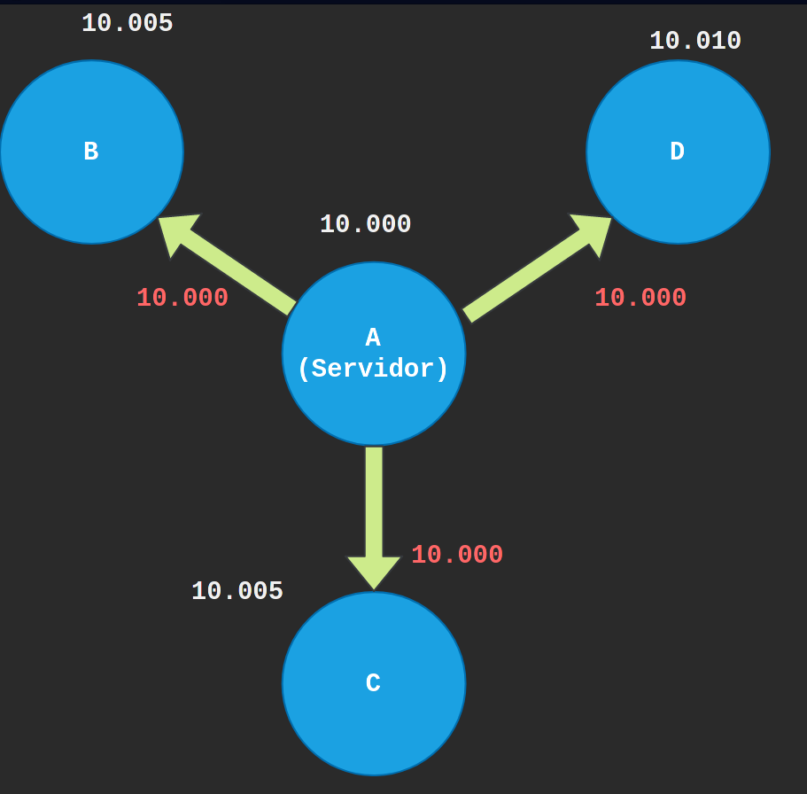
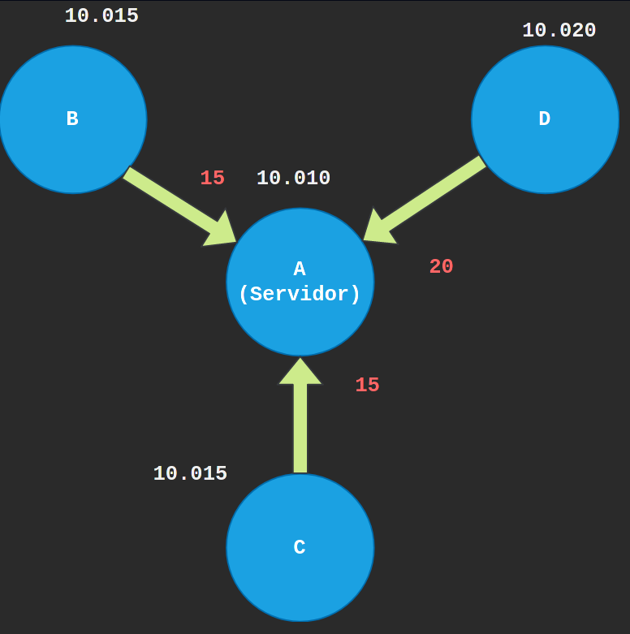
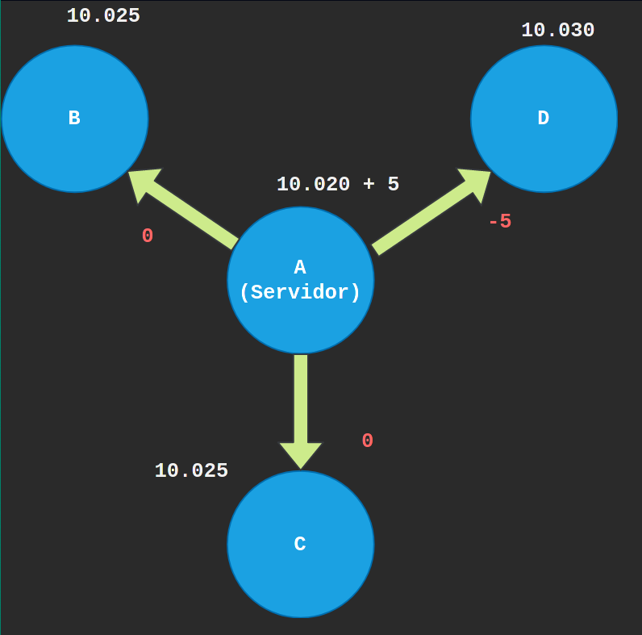
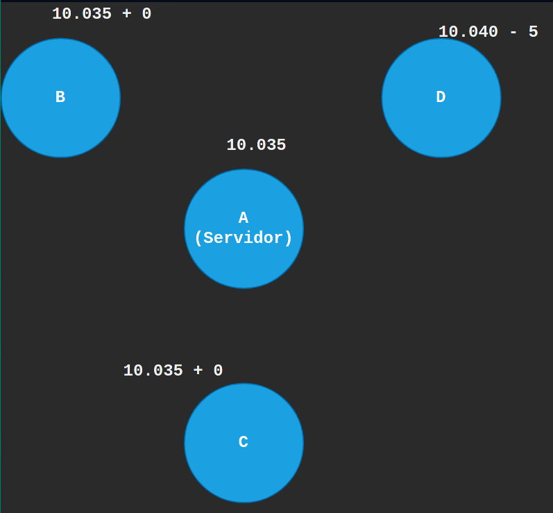
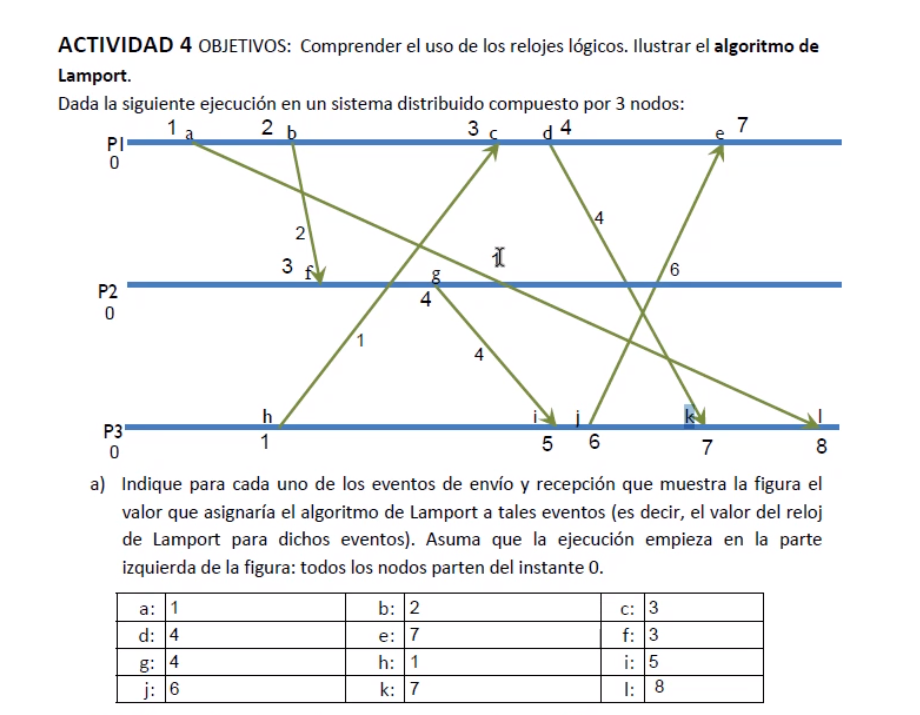
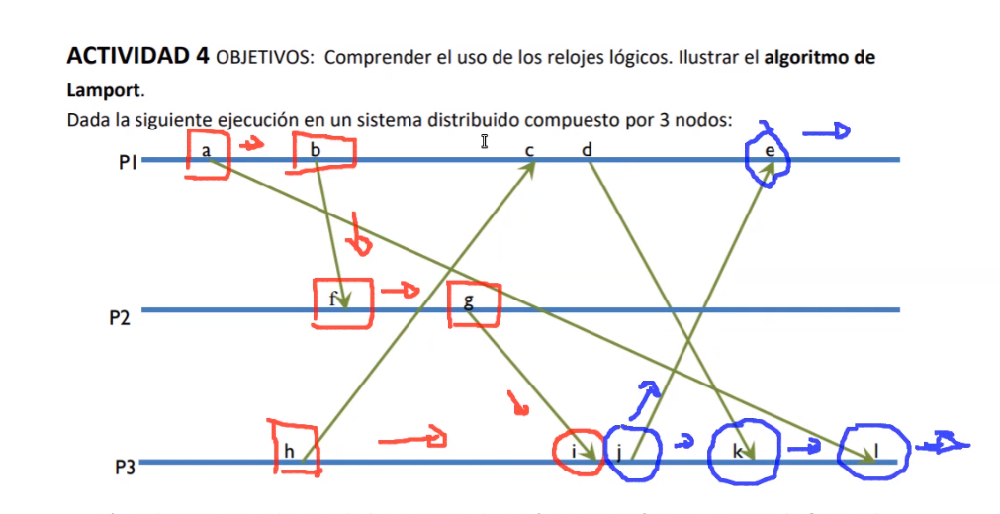
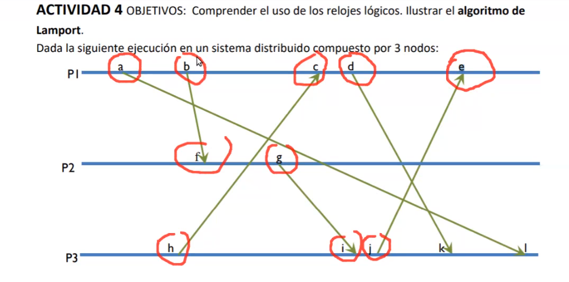

# Actividad 2

## Objetivos: Ilustrar el algoritmo de sincronización de Berkeley

En un sistema distribuido con 4 nodos se emplea el algoritmo de Berkeley para sincronizar sus relojes. Uno de los nodos (nodo A) actúa como servidor del algoritmo, mientras que los otros nodos (nodos B, C y D) actúan como clientes. Supongamos que cada nodo tiene un reloj que indica el número de tics transcurridos desde la misma base temporal; y que en un momento determinado tienen el siguiente valor para sus relojes: CA=10000, CB=10005, CC=10005 y CD=10010 (siendo Cn el reloj de cada nodo n). En dicho momento el servidor (nodo A) inicia el algoritmo de Berkeley. 

Si asumimos que han transcurrido 30 ticks de reloj durante todos esos pasos, ¿cuál será el valor final del reloj de cada nodo?

---- 

- 30 ticks entre todas las fases => cada fase será de 10 ticks (3 fases)

- Asumimos que todos los nodos están a misma distacia y que el tiempo de ida y vuelta es el mismo

#### Paso 1

El nodo A difunde su reloj inicial T0

| Instante inicial |           |
| ---------------- | --------- |
| **T0**           | **10000** |

#### Paso 2

Los nodos cliente notifica la diferencia

| D1(B)     | 10015 - 10000 = 15     |
| --------- |:---------------------- |
| **D2(C)** | **10015 - 10000 = 15** |
| **D3(D)** | **10020 - 10000 = 20** |

#### Paso 3

El nodo A ajusta la diferencia notificada y la notifica al resto

| T1      | 10020                           |
| ------- | ------------------------------- |
| **D1'** | **15 - (10020 - 10000)/2 = 5**  |
| **D2'** | **15 - (10020 - 10000)/2 = 5**  |
| **D3'** | **20 - (10020 - 10000)/2 = 10** |

| D         | (5 + 5 + 10 + 0)/4 = 5 |
| --------- | ---------------------- |
| **A1(B)** | **5 - 5 = 0**          |
| **A2(C)** | **5 - 5 = 0**          |
| **A3(D)** | **5 - 10 = -5**        |

### Paso 4

Valor final será de **10.035** en cada nodo (a expeción del nodo D ya que no se puede retrasar, sino que irá más despecio)

## Activodad 4

B) Cuncurrentes con I 

C y D

C) Concurrente con el evento E

K y L 

D
