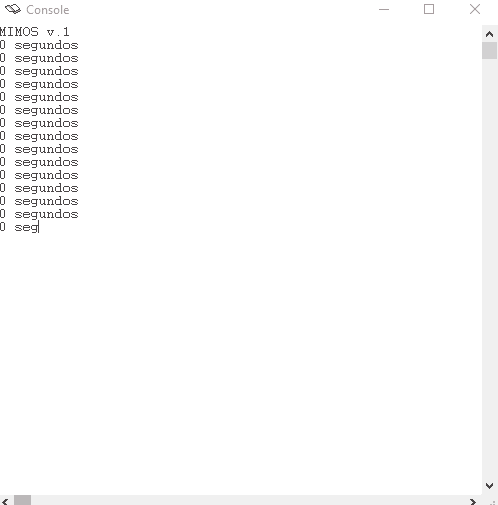

# Practica 14 ETC 

## Cuestión 1 

#### Teniendo Usuario0.s en ejecución, detenga el simulador. (Antes de respondersí en el cuadro “Execution paused by the user at PC = ...”, asegúrase que el PC apunta a una instrucción del programa de usuario, cuyas direcciones son del tipo “0x0040nnnn”. Si apunta a direcciones del tipo “0x8000nnnn”pulse que no y vuelva a intentarlo).

###### ►¿Qué vale el registro Status(registro $12) que aparece en la ventana superior del simulador?

Status = 00000003

###### ►¿En quémodo está funcionando el procesador? ¿Están habilitadas las interrupciones?

Modo Usuario y con las Interrupciones Habilitadas (esto lo sabemos por el 3 de arriba, que equivale a un 11 en binario, el cual estaría en KUc e IEc. KUc (Kernel User) habilita el modo usuario con el 1 e IC habilita las Interruption Exception con 1).

###### ►¿Qué valen los bits de máscara de interrupción?
0000
Cuando es 0 están enmascarados = habilitados

###### ►Indique con qué instrucciones del código de inicio de se MiMoSv0.handlerse inhiben las interrupciones en los periféricos teclado, reloj y consola
```s
###################################################################
##                       CÓDIGO DE INICIO                        ##
###################################################################

          .text
          .globl __start 
__start: 

## Preparo las interfaces de los periféricos

	li $t0, 0xffff0000
	sb $zero, 0($t0)	# inhibo interrupción en el HW del teclado

	li $t0, 0xffff0008
	sb $zero, 0($t0)	# inhibo interrupción en el HW de la consola

	li $t0, 0xffff0010
	sb $zero, 0($t0)	# inhibo interrupción en el HW del reloj
```

###### ►Indique cómo se inicializa el registro de estado del coprocesador 0
```s
## Preparo el registro de estado del coprocesador y fijo modo usuario

	mfc0 $t0, $12
	ori $t0, $t0, 0x0003	# Interrupciones habilitadas
	mtc0 $t0, $12
```


## Cuestión 2. Escriba el código de tratamiento de la interrupción del reloj

```s
int2:
	la $t0, segundos
	lw $t1, 0($t0)
	addi $t1, $t1, 1
	sw $t1, 0($t0)
	
	li $t0, 0xffff0010
	li $t1 , 1
	sb $t1 0($t0)
	
	b retexc

```

## Cuestión 3. Modifique el código de inicio del sistema para que la interrupción del reloj quede habilitada, tanto en la interfaz como en el registro de estado del coprocesador 0

```s
###################################################################
##                       CÓDIGO DE INICIO                        ##
###################################################################

          .text
          .globl __start 
__start: 

## Preparo las interfaces de los periféricos

	li $t0, 0xffff0000
	sb $zero, 0($t0)	# inhibo interrupción en el HW del teclado

	li $t0, 0xffff0008
	sb $zero, 0($t0)	# inhibo interrupción en el HW de la consola

	li $t0, 0xffff0010
	li $a0 , 1
	sb $a0 0($t0)	# inhibo interrupción en el HW del reloj

## Preparo el registro de estado del coprocesador y fijo modo usuario

	mfc0 $t0, $12
	ori $t0, $t0, 0x0403	# Interrupciones habilitadas
	mtc0 $t0, $12


```

## Cuestión 4. Escriba el código de la función get_time a continuación

```s
###### GET_TIME (Servicio 91)

get_time:
	la $t0, segundos
	lw $v0, 0($t0)
	b retexc
```
#### usuario1.s con MIMOSv1.handler



## Cuestión 5. ¿Podría ejecutarse correctamente Usuario0.s con el manejador MiMoSv.1?.¿Podría ejecutarse correctamente Usuario1.s con el manejador MiMoS v.0? Razone la resupuesta

Usuario0.s com MMOSv1.handle si que funciona debido a que Usuario0.s no hace ninguna llamada al sistema. Sin embago al revés no funcionaría debido a que las exepciones están desabilitadas en el manejador 0 y el Usuario1.s usa interrupciones

## Cuestión 6. Escriba el código de la función wait_time que se ha implementado
```s
###### WAIT_TIME (Servicio 92)

wait_time:
	la $t0, estado
	li, $t1, ESPERANDO
	sw $t1, 0($t0)
	
	la $t0, segundos
	lw $t1, 0($t0)
	
	add $t1, $t1, $a0
	la $t0, despertador
	sw $t1, 0($t0)
	
	b retexc
```

## Cuestión 7. Escriba el código de la interrupción del reloj, desde la etiqueta int2

```s
## Tratamiento de la interrupción de RELOJ

int2:
	# Por implementar
	la $t0, segundos
	lw $t1, 0($t0)
	addi $t1, $t1, 1
	sw $t1, 0($t0)
	
	li $t0, 0xffff0010
	li $t1, 1
	sb $t1 0($t0)
	
	la $t0, estado
	lw $t1, 0($t0)
	li $t2, ESPERANDO
	
	bne $t1, $t2, finsi
	
    la $t0, segundos
    lw $t1, 0($t0)
    la $t0, despertador
    lw $t2, 0($t0)
		
    bne $t1, $t2, finsi
			
    la $t0, estado
    li $t1, LISTO
    sw $t1, 0($t0)
# 
finsi:	

	b retexc			# fin
```


## Cuestión 8. Detenga el programa usuario2.s justamente después de haber escrito el tiempo actual (n segundos). ¿Qué valen el PC y el registro Status?

Status = 00000403   PC = 0x00400040  [`b proceso_ocioso`]

### ¿Qué código se está ejecutando: el manejador, el proceso de usuario o el proceso ocioso?

El proceso ocioso
