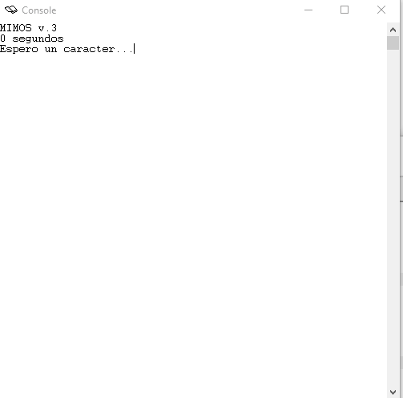

# Practica 15 ETC

## Cuestión 1. Escriba el código correspondiente a la llamada al sistema read_char.

```s
read_char:
    li $t0, 0xffff0000
    li $t1, 2
    sb $t1, 0($t0)
    li $t1, esperando_leer
    sw $t1, estado
    b retexc

```

## Cuestión	2.	Escriba el código correspondiente a la interrupción de teclado, desde la etiqueta int0

```s
int0:
	lw $t0, estado
	li $t1, espera_read_char
	
	bne $t0, $t1, fintec
    li $t0, 0xffff0004
    lb $a0, 0($t0)

    li $t0, 0xffff0000
    sw $0, 0($t0)

    li $t1, listo
    sw $t1, estado
	
fintec:
	b retexc		# fin
```

### ► Programe la máscara de interrupciones en la sección de inicio del sistema, línea INT0* habilitada (además de la del reloj).Escriba el valor de la máscara en hexadecimal

```s
    mfc0 $t0, $12
    ori $t0, $zero, 0x0503
    mtc0 $t0, $12

```

## Cuestión 3 Escriba el código correspondiente a la llamada al sistema print_char

```s
print_char:
    li $t0, 0xffff0008
    li $t1, 2
    sb $t1, 0($t0)
    
    li $t1, espera_print_char
    sw $t1, state
    b retexc
```

## Cuestión 4 Escriba el código correspondiente a la interrupción de teclado, desde la etiqueta int1

```s
int1:
	lw $t0, estado
	li $t1, espera_print_char
	
	bne $t0, $t1, fincon
    li $t0, 0xffff000c
    sb $a0, 0($t0)

    li $t0, 0xffff0008
    sw $0, 0($t0)

    li $t1, listo
    sw $t1, estado
	
fincon:
	b retexc		# fin
```

### Programe la máscara de interrupciones adecuada en la sección de inicio del sistema. Para probar el nuevo tratamiento se puede utilizar cualquier programa de usuario anterior, pues todos ellos utilizan la función print_char. Escriba el valor de la máscara en hexadecimal


```s
registro de estado del coprocesador y fijo modo usuario

	mfc0 $t0, $12
	ori $t0, $0, 0x0703	# Interrupciones habilitadas
	mtc0 $t0, $12
```


