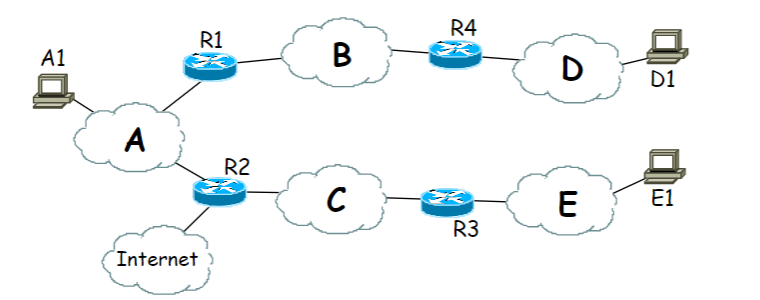

# Practica 14 - Protocolo ARP 
 
## Ejercicio 1

En la figura se muestra un conjunto de redes locales Ethernet (A, B, C, D y E) de una empresa conectadas entre sí por cuatro routers (R1, R2, R3 y R4). La red se conecta a Internet a través del router R2. Emplearemos la notación IP(D1) e IP(R4D) para denotar las direcciones IP del host D1 y el Router 4, adaptador conectado a la red D.  Del  mismo  nodo,  MAC(D1)  y  MAC(R4D)  se  refieren  a  las  direcciones  físicas correspondientes. Supondremos todas las máquinas correctamente configuradas y las resoluciones DNS en caché

1. Si suponemos que inicialmente las cachés ARP asociadas a los adaptadores están vacías, indica cómo quedarán las cachés ARP de todos los adaptadores después de que A1 envíe un mensaje a D1 y después de que D1 le conteste a A1.

Todos los nodos por los que pasa el mensaje de A1 a D1 y viceversa

2. Si a continuación, E1 envía un mensaje a D1, ¿cómo quedan las cachés ARP?

Desde E1 a R1 se cargaran en la cache de los nodos correpondiente, pero de R1 a D1, como ya están cargados no se vuelven a añadir
