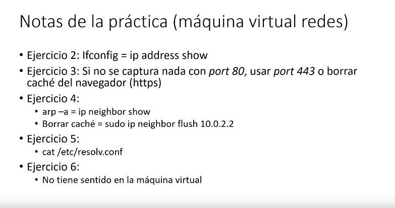
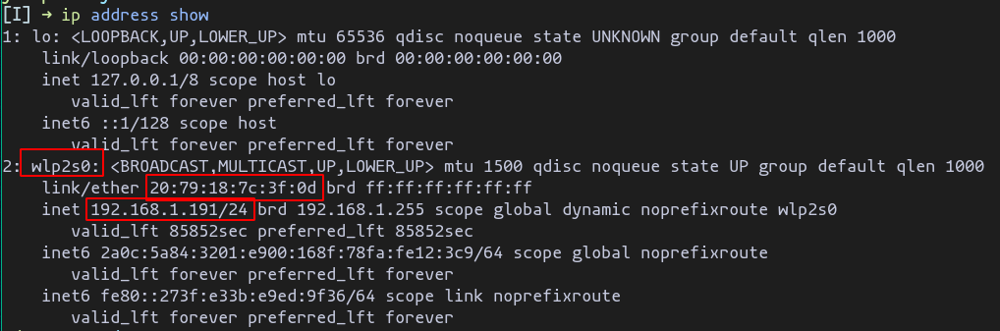
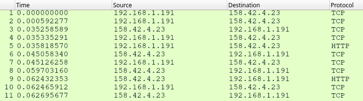
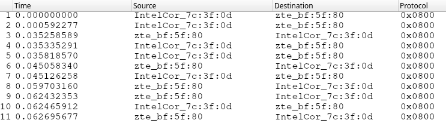
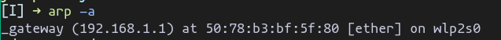
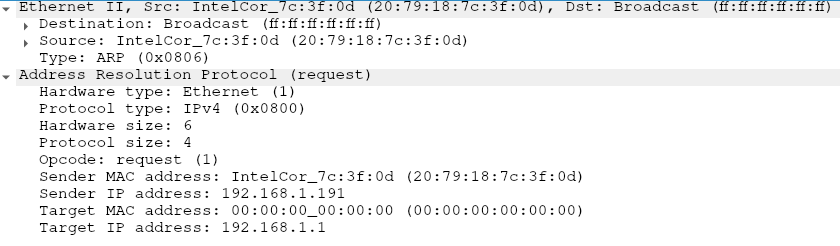
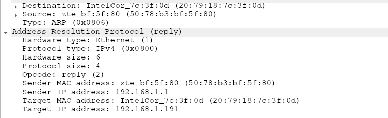
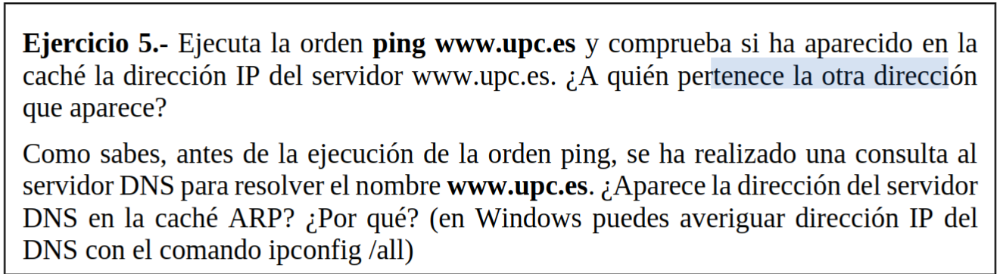

# Practica 14 - Protocolo ARP

## Ejercicio 1

En la figura se muestra un conjunto de redes locales Ethernet (A, B, C, D y E) de una empresa conectadas entre sí por cuatro routers (R1, R2, R3 y R4). La red se conecta a Internet a través del router R2. Emplearemos la notación IP(D1) e IP(R4D) para denotar las direcciones IP del host D1 y el Router 4, adaptador conectado a la red D.  Del  mismo  nodo,  MAC(D1)  y  MAC(R4D)  se  refieren  a  las  direcciones  físicas correspondientes. Supondremos todas las máquinas correctamente configuradas y las resoluciones DNS en caché

1. Si suponemos que inicialmente las cachés ARP asociadas a los adaptadores están vacías, indica cómo quedarán las cachés ARP de todos los adaptadores después de que A1 envíe un mensaje a D1 y después de que D1 le conteste a A1.

Todos los nodos por los que pasa el mensaje de A1 a D1 y viceversa

2. Si a continuación, E1 envía un mensaje a D1, ¿cómo quedan las cachés ARP?

Desde E1 a R1 se cargaran en la cache de los nodos correpondiente, pero de R1 a D1, como ya están cargados no se vuelven a añadir

## Ejercicio 2

Mediante el comando ifconfig averigua cuántos adaptadores de red tiene la máquina con la que estás trabajando. Anota la dirección física de cada uno de ellos y observa si son del mismo fabricante. ¿Todos los adaptadores tienen direcciones IP asignadas? ¿De qué tipo es cada una de las direcciones IP que te aparece?

|Adaptador|Dirección Física|Dirección IP|
|--|--|--|
|wlp2s0| 20:79:18:7c:3f:0d|192.168.1.191 (privada)|

## Ejercicio 3

Realiza una captura con el Wireshark mientras cargas en el navegador la página web de la Universidad de Valencia: www.uv.es. Utiliza el filtro de captura "tcp port 80 and host 147.156.200.249" para poder quedarte con el tráfico HTTP. Selecciona el primer mensaje HTTP de petición que transporta el GET y analiza en la ventana intermedia las diferentes cabeceras de la pila de protocolos TCP/IP

- ¿Qué tipo de direccionamiento se utiliza en el nivel de transporte? ¿Y en el nivel de red?
  - Transporte (TCP/UPC) => Puertos
  - Red => IP
- Expande la información relacionada con el nivel de enlace (Ethernet) ¿Cuál es la dirección física origen? ¿Y la dirección física destino?
  - Dest: 50:78:b3:bf:5f:80 
  - Src: 20:79:18:7c:3f:0d

- Recordando los contenidos aprendidos en las sesiones teóricas. ¿A quién piensas que pertenece esta última dirección física?
  - al router de nuestra red que nos encamina hacia Internet
- Observa que Wireshark expresa las direcciones físicas en dos formatos. ¿Qué dígitos identifican al fabricante del adaptador? ¿Qué código identifica a los fabricantes que te aparecen?
  - Los que identifica al fabricante son los 24 primeros bits(3 bytes)
  - Dest 50:78:b3 -> zte
  - Src 20:79:18 -> IntelCor
- En la cabecera de Ethernet aparece un campo más que indica el Tipo. ¿Qué se identifica con este campo? ¿Qué valor tiene en nuestro caso y a quién identifica?
  - Identifica el tipo de protocolo usado en la capa de red
  - El valor 0x800 => Protocolo IP

El analizador Wireshark muestra, por defecto, información del nivel más alto posible. Sin embargo, es posible centrarnos en los niveles inferiores (enlace y físico). Para ello, a través de la opción Analize->EnabledProtocols, deshabilitaremos el protocolo IPv4. Observa cómo ha cambiado el aspecto de las ventanas del Wireshark, especialmente la superior. ¿Qué valores aparecen ahora en las columnas Origen, Destino y Protocolo? Vuelve a habilitar el protocolo IP para tener una visión completa de TCP/IP.

## Ejercicio 4

Desde una ventana de comandos ejecuta la orden arp --a para comprobar el contenido de la caché. Anota los resultados. ¿A qué máquina o máquinas pertenece la información que obtienes? ¿Qué relación tiene una de las direcciones obtenidas con el ejercicio anterior?

Aparecen la dirección IP y el MAC del router de la red, que en ejercicio anterior nos redirigió a internet

- ¿Qué niveles de la pila de protocolos TCP/IP aparecen en el mensaje ARP? ¿Por qué? ¿Dónde se encapsulan los mensajes ARP?
  - Físico y enlace
  - Porque ARP se generan a nivel de enlace
  - Se encapsulan en tarjeta de red
- Evalúa la cabecera Ethernet de la petición ARP. Observa los valores de las direcciones origen y destino, así como el campo de Tipo. ¿Qué identifica este último campo?
  - Que el protocolo utilizado es el ARP
- Observa los campos del mensaje ARP. ¿Qué información proporciona la consulta ARP al resto de nodos de la red? ¿En qué campo indica la dirección IP consultada? ¿Cuál es la dirección física de tu router?
  - Nuestra dirección ip y mac
  - Target IP address
  - 50:78:b3:bf:5f:80

Request:

Reply:

- Observa las direcciones origen y destino de la cabecera Ethernet, e identifica a quién pertenece  la  dirección  física  origen.  Comprueba  que  el  campo  Tipo  identifica nuevamente al protocolo ARP.
  - Dirección origen es el router
  - Dirección dest mi maquina 
- ¿Qué direcciones aparecen en el interior del mensaje ARP de respuesta? ¿A quién pertenecen? ¿Dónde aparece la información que nuestro equipo había solicitado?
  - La dirección tanto IP como MAC del router como de la mi maquina
  - Sender Mac Address 
- ¿Qué campo permite diferenciar una consulta ARP de una respuesta?
  - Opcode: relpy(2) o request(1)

## Ejercicio 5

Ejecuta la orden ping www.upc.esy comprueba si ha aparecido en la caché la dirección IP del servidor www.upc.es. ¿A quién pertenece la otra dirección que aparece?

No aparece, porque el protocolo arp trabaja en el nivel de enlace dentro de la misma red por tanto solo necesitamos la MAC del router que nos redirige al exterior

## Ejercicio 6

192.168.1.141 => Dir. IP del movil conectado a la misma red

