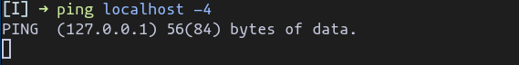

# Practica 7 - Cortafugos IPTABLES

## Ejercicio 1

### 1\. Vamos a comenzar modificando la configuración inicial para comprobar sus efectos. Para ello emplearemos la opción -P (policy) tecleando la siguiente orden:

`sudo iptables -P OUTPUT DROP`

## Ejercicio 2

## Ejercicio 3

## Ejercicio 4

## Ejercicio 5

## Ejercicio 6

## Ejercicio 7

## Ejercicio 8

## Ejercicio 9
