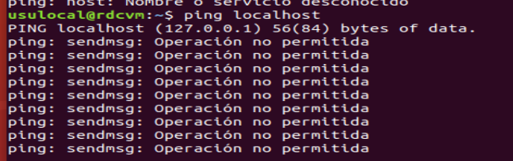
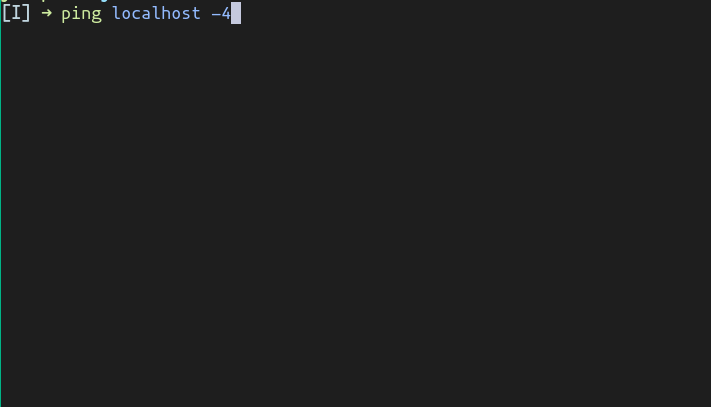
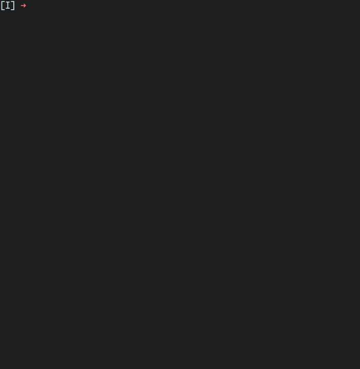
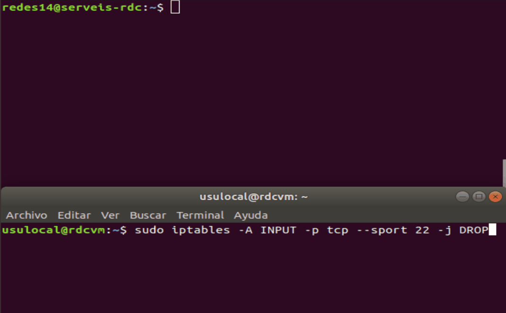

# Practica 7 - Cortafugos IPTABLES

## Ejercicio 1

### 1. Vamos a comenzar modificando la configuración inicial para comprobar sus efectos. Para ello emplearemos la opción -P (policy) tecleando la siguiente orden:

`sudo iptables -P OUTPUT DROP`

### 2. A continuación ejecuta la orden ping localhost y observa qué sucede.



No deja conectarse "Operatio not permited"

## Ejercicio 2

### 1. Como esta primera experiencia no parece demasiado útil porque produce una desconexión total, vamos a devolver al equipo a su estado inicial. Teclea ahora

`ip tables -P OUTPUT ACCEPT`

### 2. Comprueba que de nuevo los servicios de red vuelven a funcionar. Ejecuta la orden ping localhost y observa qué sucede ahora



## Ejercicio 3

### 1. Vamos a bloquear el tráfico local, es decir, el que se produce sobre el dispositivo lo y para ello tecleamos la siguiente orden:

`sudo iptables ­A INPUT ­i lo ­j DROP`

### 2.Seguidamente verificamos si tiene el efecto deseado tecleando ping   localhost.¿Obtenemos respuesta? Prueba a hacer ping www.upv.es ¿funciona? 



Podemos enviar pero no recibir

## Ejercicio 4

1. Comprueba que puedes acceder mediante SSH a zoltar.redes.upv.es y establece una
conexión utilizando el usuario y contraseña que te indique el profesor1

 `ssh redes14@zoltar.redes.upv.es`

 contraseña: "bloqueo"

2. Abre otra terminal en tu ordenador, y en ella teclea 

`sudo iptables -­A INPUT -­p tcp --­­sport 22 -­j DROP`

3. Ahora vuelve a la ventana de tu conexión SSH con zoltar y teclea 123456 ¿qué
sucede?¿por qué?

No se nos muestra lo que escribimos porque no recibimos la entrada del ssh

4. Vuelve a la segunda terminal, y ahora teclea sudo iptables ­D INPUT ­p tcp
­­sport 22 ­j DROP ¿Qué sucede ahora? ¿Aún funciona tu sesión ssh con zoltar?



ahora recebimos todo lo que habíamos escrito anteriormente

5. Finaliza la sesión ssh y cierra esa terminal

## Ejercicio 5

1. Abre un navegador y carga la página www.upv.es

2. Ahora en una ventana de terminal teclea 

 `sudo iptables -­A OUTPUT -­p tcp -­d www.upv.es --­­dport 80 ­-j DROP`

3. Visualiza el estado de la cadena con la orden sudo iptables ­L.

```sh
usulocal@rdcvm:~$ sudo iptables -L
Chain INPUT (policy ACCEPT)
target     prot opt source               destination         
DROP       all  --  anywhere             anywhere            

Chain FORWARD (policy ACCEPT)
target     prot opt source               destination         

Chain OUTPUT (policy ACCEPT)
target     prot opt source               destination         
DROP       tcp  --  anywhere             ias.cc.upv.es        tcp dpt:http
```

4. Intenta recargar la página en el navegador. ¿Qué sucede?

No funciona porque hemos bloqueado la salida al servidor de la UPV 

5. prueba a visitar otra página, como por ejemplo www.ua.es ¿funciona?

Sí

## Ejercicio 6

1. Asegúrate mediante la orden sudo iptables ­L  que has eliminado la regla del
ejercicio 5.

Elimiar la regla:

`sudo iptables -D OUTPUT -p tcp -d www.upv.es --dport 80 -j DROP` 

2. Añade una única regla que permita sólo el tráfico de salida destinado al puerto 80 con destino a www.upv.es y descarte el resto de tráfico destinado al puerto 80. Para poder especificar el número de puerto en una regla es necesario especificar también el protocolo de transporte mediante la opción -p. En nuestro caso, ­p tcp.

`sudo iptables -A OUTPUT -p tcp ! -d www.upv.es --dport 80 -j DROP`

3. Abre un navegador e intenta recargar las páginas www.upv.es y www.redes.upv.es. Comprueba que la regla que has añadido funciona correctamente. No deberías de tener acceso al segundo servidor.
4. Añade otra regla para permitir el tráfico de salida del protocolo ssh destinado únicamente a zoltar.redes.upv.es. 

`sudo iptables -A OUTPUT -p tcp -d zoltar.redes.upv.es --dport 22 -j ACCEPT`

5. Ahora  en  una  ventana  de  terminal  intenta  acceder  mediante  ssh  a zoltar.redes.upv.es.  Es  suficiente  con  que  obtengas  respuesta  del  destino,  no  es necesario que completes el acceso. Después, desde otra ventana de terminal intenta acceder por ssh a cualquier otro host (por ejemplo 158.42.4.23). Comprueba que sigues teniendo acceso a la web de la upv. Con estos tres pasos podrás comprobar si la reglaque has añadido funciona correctamente.
6. Elimina la regla referente al tráfico ssh con la orden -D

`sudo iptables -D OUTPUT -p tcp -d zoltar.redes.upv.es --dport 22 -j ACCEPT`

7. Añade estas dos nuevas reglas:
   
a. `sudo iptables ­A OUTPUT ­p tcp ! ­d zoltar.redes.upv.es ­j DROP`
b. `sudo iptables ­A OUTPUT ­p tcp ­d  www.upv.es ­­dport 80 ­j ACCEPT`

8. Intenta recargar la página www.upv.es en el navegador. ¿Funciona? Comprueba con la orden sudo iptables ­L cuál es el contenido de la lista de reglas, e intenta explicar el significado de las tres reglas que aparecen. Piensa en cómo afecta el orden en el que están. ¿Cómo habría que modificarlas para poder acceder a www.upv.es?

No funciona la regla a bloquea upv.es por lo tanto tenemos que cambiar el orden

9.  Vamos a comprobarlo. Elimina la primera regla del punto 7: sudo   iptables   ­D OUTPUT ­p tcp ! ­d zoltar.redes.upv.es ­j DROP. Ahora vamos a añadirla al final de la cadena: sudo   iptables   ­A   OUTPUT   ­p   tcp   !   ­d zoltar.redes.upv.es ­j DROP

## Ejercicio 7

1. Crea la regla que realizará el registro: 
sudo iptables -A INPUT -p tcp --dport 22-j LOG
2. Ahora vamos a instalar un servidor SSH en nuestra máquina, para ello teclea:sudo apt install sshy acepta la instalación. Para comprobar que el servidor está en marcha puedes ejecutar:  systemctl status ssh.servicey ver que escucha en el puerto 22.
3. Ahora vamos a acceder al servidor SSH local. Ejecutassh127.0.0.1. No hace falta que inicies sesión en ssh, simplemente interrúmpelocon Ctrl+C 
4. Ahora teclea dmesgy analiza laslíneasdel listado. Busca unadonde aparezca el flag SYNactivado. ¿Qué ves? ¿Entiendes lo que significa?


## Ejercicio 8

1. Comienza anulando la regla anterior: sudo iptables -D INPUT -p tcp --dport 22-j LOG
2. Y ahora vamos a crear una regla de registro que realmente sí detecta las peticiones de conexión al puerto 22. Para ello tecleamos:  sudo iptables -A INPUT -p tcp --dport 22--tcp-flags ALL SYN -j LOG
3. Si  ahora  intentamos  conectarnos  al  servidor  de SSH observaremos  con  la  orden dmesgque solo se registra un mensaje por intento de conexión

## Ejercicio 9

1. Vamos a añadir una nueva regla que registre las conexiones de salida a cualquier servidor web, tecleamos(las dos líneas son una única orden):sudo iptables -A OUTPUT-p tcp --match multiport --dports 80,443--tcp-flags ALL SYN -j LOG(fíjate que hemos cambiado a OUTPUT. Además, hemos utilizado la opción multiportpara filtrar usandovarios puertosdestino).  Esta regla registrará todas las conexiones a cualquier servidor HTTP o HTTPSefectuadas desde este ordenador.
2. Accede a varios servidoresservidor web,
3. Comprueba mediante la orden dmesgquese ha registrado los accesos a las páginas web.Busca aquellas líneas con el valor DPT=80 o DPT=443. ¿Has obtenido más de un mensajepor cada servidor web? Si es así, ¿por qué crees que ocurre esto?
4. Comprueba mediante la orden sudo iptables -L-vla lista de reglas que está activa en este momento en tu sistema. Observa queen esta presentación la columna pkts te indica cuántas veces se ha cumplido cada regla. También puedes ver el número de paquetes  y  bytes  recibidos  (INPUT)  y  enviados  (OUTPUT)  y,  si  fuera  el  caso,  los reenviados (FORWARD).
5. Elimina la regla que has añadido en este ejercicio.
