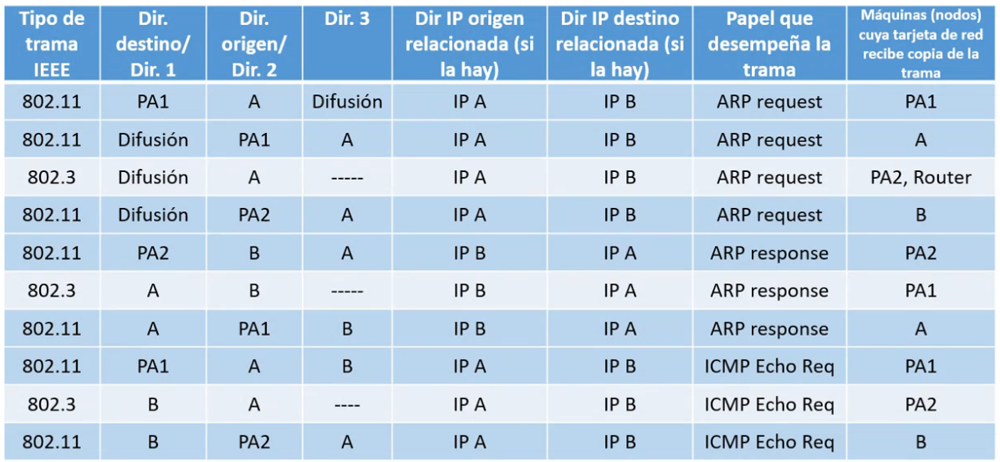

# Pratica 16 RED - Wifi

## Ejercicio 1

|Tipo de traa IEEE| Dir. destino / Dir. 1| Dir. origen/ Dir. 2| Dir. 3|Dir. IP origen relacionada (si la hay) | Dir. IP destino relacionado (si la hay)| Papel que desempeña la trama| Máquinas cuya tarjeta red recibe copia de la trama|
|--|--|--|--|--|--|--|--|
|802.11|PA1     |A|Difusión| IPA|IPB|ARP request|PA1|
|802.11|Difusión|PA1|A|IPA|IPB|ARP request|A|
|802.3 |Difusión|A|--|IPA|IPB|ARP request|PA2,Router|
|802.11|Difusión|PA2|A|IPA|IPB|ARP request|B|
|802.11|PA2     |B|A|IPB|IPA|ARP response|PA2|
|802.3 |A|B|--|IPB|IPA|ARP response|PA1|
|802.11|A|PA1|B|IPB|IPA|ARP response|A|
|802.11|PA1|A|B|IPA|IPB|Trama ICMP|PA1|
|802.3 |B|A|--|IPA|IPB|Trama ICMP|PA2|
|802.11|B|PA2|A|IPA|IPB|Trama ICMP|B|

## Ejercicio 2

### Abre desde el wireshark el fichero wifi2cable_1 y responde a las siguientes  cuestiones

1. De acuerdo al formato de las tramas que muestra wireshark, ¿se trata de las tramas capturadas en el segmento de red cableado o en el segmento inalámbrico?

   - Cambleado

2.  ¿Cuál es la dirección IP del ordenador A? ¿Cuál es la dirección IP del ordenador B?

    - A: 192.168.1.130
    - B: 192.168.1.128

3. ¿Por qué se generan las dos primeras tramas de la captura?

   - Porque las cachés ARP están vacías

4. ¿Cuáles son las direcciones físicas que aparecen en las tramas de la captura? ¿A quiénes corresponden dichas direcciones físicas?

   - A:  00:16:ea:28:5a:88   
   - B:  00:24:1d:c2:42:25 

5. ¿Cuál es la longitud de los datagramas enviados? ¿Ha hecho falta fragmentar dichos datagramas debido a un MTU demasiado pequeño? ¿Cuál es la longitud de los datos contenidos en el mensaje ICMP?

   - 98 Bytes
   - No
   - 48 Bytes

## Ejercicio 3 

### ¿Cuál es la longitud de los datagramas enviados? ¿Ha hecho falta fragmentar dichos datagramas debido a un MTU demasiado pequeño? ¿Cuál es la longitud de los datoscontenidos en el mensaje?

1. De acuerdo a la información contenida en dicha captura, ¿se trata de las tramas capturadas en el segmento de red cableado o en el segmento inalámbrico?

   - Inalambrico

2. ¿Qué tipos diferentes de tramas encuentras en la captura?

   - ARP 

3. ¿Puedes ver el contenido de los mensajes ARP e ICMP que has visto en la captura anterior?¿Cuál crees que es la razón por la que no puedes ver el contenido de dichos mensajes?

   - Porque esta enriptado ya que el flag protected está a 1

4. Intenta localizar en esta captura las tramas generadas al ejecutar la orden ping y que complementan el tráfico analizado en el ejercicio anterior.

   - Tramas 4 y 5

## Ejercicio 4

### Tras modificar las opciones de cifrado de acuerdo a la descripción anterior, responde a las siguientes cuestiones:

1. Localiza las tramas asociadas al protocolo ARP. ¿Cuántas tramas hay?¿Hay el mismo número de tramas ARP que en la captura anterior?¿Por qué?

   - 3 
   - No, porque el host A manda al PA que haga difusio preguntando por B y el PA es quien have la difución

2. ¿Cual es la dirección física del punto de acceso? ¿Se trata de la dirección física en la parte cableada o en la parte inalámbrica?¿Aparecía dicha dirección física en la captura anterior? ¿Por qué?
  
   - 38:72:c0:a2:c9:f6
   - En la parte inalambrica
   - No, porque para el protocolo 802.3 los PA no existen

3. Céntrate en las dos primeras tramas ARP que se envían (tramas 1 y 2 en la captura).Aparentemente son iguales. ¿Qué diferencias observas entre ellas?

   - Primero el host envñia PA una trama ARP con MAC destion Difusión y PA have la difusión

4. Analiza los bit “From DS” y “To DS” de ambas tramas. ¿Qué conclusiones extraes? ¿Estas conclusiones son coherentes con las diferencias que has observado en el punto anterior?

   - No, la Trama 1 (01 to DS: 1 from DS: 0) y la Trama 2 (10 to DS: 1) Los bits aparecen al reves pero wireshark lo esplica bien 

5. Busca en la captura la respuesta ARP. ¿Coinciden las direcciones MAC con las de la dcaptura anterior? ¿Son diferentes? ¿Por qué?

   - Son diferentes, debido a que en esta captura aparecen la MAC del PA es en la targeta inalámbrica y en la anterior captura en la tarjeta Ethernet

6. Centrémonos ahora en la petición y respuesta del ping. ¿Cuáles son las direcciones MAC que intervienen en ambas tramas? Esas direcciones, ¿son coherentes con las direcciones MAC de la captura anterior?

   - Son diferentes, debido a que en esta captura aparecen la MAC del PA es en la targeta inalámbrica y en la anterior captura en la tarjeta Ethernet

7. ¿Cuáles son las direcciones IP que aparecen en esta captura? ¿Son las mismas que las que aparecían en la captura anterior? ¿Cuál es la dirección IP del punto del acceso

   - A y B
   - El punto de acceso trabaja a nivel de enlace, por lo tanto no tiene IP

8. Fíjate en los números de secuencia de las diferentes tramas que se generan como consecuencia de la orden ping (compara la respuesta del ARP y la respuesta del ping). ¿Son consecutivos?

   - Sí, pero en envíos y en respuestas por separado

9.  De acuerdo a la captura que estás analizando, ¿se han fragmentado los mensajes ICMP?¿Y los mensajes ARP?

    - No

## Ejercicio 5

### Abre con el programa wireshark el fichero de captura wifi2wifi_1 y contesta a las siguientes preguntas:

1. ¿Qué contiene este fichero de captura? ¿Es correcto que contenga la(s) trama(s) queaparecen en la pantalla? ¿Falta alguna trama?

   - Solo aparece una trama y es correcto, debido a que esto ocurre cuando A pregunta por C, el PA lo retransmite tanto por 802.11 como 802.3 esta trama correspone a 802.3, nadie responde porque C no esta en Ethernet

2. Comprueba las direcciones MAC y las direcciones IP que aparecen en el fichero. ¿Aquién corresponden estas direcciones? ¿Son las mismas que en el escenario anterior?

   -  IP A y IP C
   -  MAC: A MAC: Difusión
   -  No, porque antes C no estava pero el resto sí

3. A partir de la información contenida en esta captura, ¿puedes conocer las direcciones MAC y/o IP de los ordenadores incluidos en el escenario de la figura?

   - No, hace MAC de PA, B y C, IP de B

## Ejercicio 6.

### Abre con el programa wireshark el fichero de captura wifi2wifi_2 y contesta a las siguientes preguntas:

1. ¿En cuántas tramas aparece la dirección MAC del ordenador A? ¿Qué papel desempeñan dichas tramas?

2. Respecto a la primera trama que contiene la dirección MAC del ordenador A como origen de la trama, ¿qué papel desempeña dicha trama? ¿qué información se busca con dicha trama? ¿Cuáles son las direcciones MAC involucradas en esa primera trama? ¿A quiénes perteneces esas direcciones MAC?

   - En una trama ARP, usado pra averiguar la dirección mac del destinatario 
   - La de A, de PA y la de difusión

3. Volviendo sobre la trama anterior, ¿qué direcciones IP aparecen? ¿a quiénes pertenecen dichas direcciones IP?

4. La trama anterior parece que esté repetida en la captura. Analiza el por qué de esta duplicidad.

5. Localiza la trama que se genera como contestación a la trama anterior. ¿Quién transmite dicha trama? ¿Quién es el creador original de dicha trama? ¿Aparece en la captura la trama original transmitida por el creador inicial de dicha trama? ¿Por qué?

   - La transmite PA. La crea C
   - No aparece porque está en la parte Ethernet

6. De acuerdo a la trama anterior, ¿cuál es el valor de la información buscada en la primera trama que envía el ordenador A?

   - Quiere saber cual es al dirrección física de C

7. Vuelve sobre las tramas analizadas y comprueba los bits “ToDS” y “FromDS” de las mismas. ¿El valor de dichos bits para cada una de las tramas es el esperado?

   - Sí

8. Busca las tramas que contienen el echo request y el echo reply que se transmiten como consecuencia de la orden “ping -c 1 dir_IP_C”. ¿Cual es la dirección MAC que transmite cada una de esas tramas? ¿Y la dirección MAC del creador del mensaje inicial contenido en las tramas? ¿Qué direcciones destino se utilizan? Observa que tanto la dirección MAC del punto de acceso como las de la fuente y destino de las tramas aparecen en la cabecera de la trama en distinto orden dependiendo de que actúen como dirección 1, 2 o 3 (puedes mirar el apartado 3 de la práctica para revisar el formato de las tramas). ¿Quién debe quedarse copia de cada una de las tramas? ¿Serán retransmitidas dichas tramas 

   - Recuest: 
     - Emite A 
     - Crea A 
     - Destino C
   - Reply
     - Emite C 
     - Crea C 
     - Destino A

9.  Analiza el campo número de secuencia de las tramas siguientes: beacon, ARP y ping ¿Encuentras alguna relación entre los números de secuencia que usa el punto de acceso?

    - Sí, las tramas que reencia el PA llevan números de sequencia correlativos

10. Teniendo en cuenta que las estaciones A y C no se ven entre ellas, pero que ambas ven al punto de acceso, ¿falta alguna trama relacionada con la orden ping en la captura?

    - No, porque el request del PA a C, A ve las tramas porque está dentro del alcance del PA pero no las indentifica como ICMP porque no vas dirigidas a el
